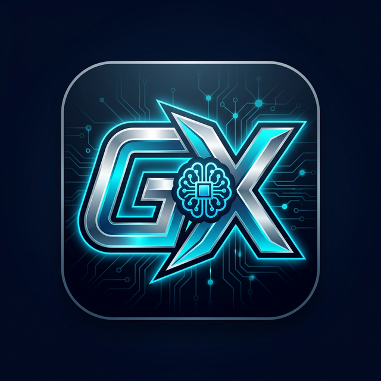

<div align="center">
  

  # GamerX AI

  **A Next-Generation, Privacy-First, Edge AI Assistant for Android**
  <br />
  Powered by NVIDIA NIM & On-Device Open-Source Models
  <br /><br />
  
  [](https://github.com/GamerX3560/GamerX-AI/releases)
  [](https://www.android.com/)
  [](LICENSE)
  [](https://kotlinlang.org)
</div>

---

## 🚀 Overview

**GamerX AI** is a cutting-edge Android application designed to provide a highly conversational, intelligent, and context-aware AI assistant experience. Engineered for both power users and privacy advocates, GamerX AI seamlessly bridges the gap between ultra-fast cloud inference and absolute off-the-grid local execution.

Whether you need complex code refactoring, system architecture planning, or just a personalized tech companion, GamerX AI delivers.

---

## ✨ Key Features

### ☁️ Blazing Fast Cloud Execution (NVIDIA NIM)
Harness the power of the `qwen2.5-coder-32b-instruct` model via NVIDIA's enterprise-grade API for lightning-fast, highly structured, and accurate responses formatting code and markdown natively.

### 🔒 True On-Device Edge AI (GGUF via Llama.cpp)
Complete privacy. Run Quantized (Q4) GGUF models directly on your phone's processor using a native Llama.cpp JNI wrapper.
- **Background Downloads:** Fetch `Qwen 0.8B`, `2B`, or `4B` GGUF files seamlessly via Android's native `DownloadManager`.
- **Zero Telemetry:** What happens on your device, stays on your device.

### 🔄 Multi-Device Synchronization
Log in via Google (powered by **Supabase Auth**) and watch your conversations instantly synchronize across all your Android devices using secure, real-time Row-Level Security (RLS) policies over the Supabase Postgrest API.

### 🕵️ Incognito Mode
Tap "Private Chat" to engage in volatile, RAM-only conversations. These sessions bypass the local SQLite database and strictly avoid Supabase synchronization, vanishing permanently when closed.

### 💻 Developer-First UI
Built with Jetpack Compose featuring AMOLED Dark Mode, Cyan accents, and an integrated Mikepenz Markdown Renderer to beautifully format syntax-highlighted code blocks.

---

## 🛠️ Technology Stack

- **Language:** Kotlin
- **UI Framework:** Jetpack Compose (Material 3)
- **Local Database:** Room (SQLite) with Coroutine Flows
- **Backend / Auth:** Supabase (gotrue-kt, postgrest-kt)
- **Edge Inference:** native Llama.cpp bindings
- **Networking:** Ktor, OkHttp3
- **Dependency Injection / Concurrency:** Kotlin Coroutines

---

## 📦 Installation

To test the latest Alpha build of GamerX AI on your Android device:

1. Navigate to the [Releases](https://github.com/GamerX3560/GamerX-AI/releases) section of this repository.
2. Download the attached `app-debug.apk` bundle.
3. Install the APK directly on your Android device (ensure "Install from Unknown Sources" is enabled).

---

## ⚙️ Build Instructions

To build the project from source, you will need Android Studio and a valid Gemini/NVIDIA API Key.

1. Clone the repository:
   ```bash
   git clone https://github.com/GamerX3560/GamerX-AI.git
   ```
2. Open the project in Android Studio.
3. Replace the placeholder `GEMINI_API_KEY` in `app/build.gradle.kts` with your actual API key.
4. Run `supabase_schema.sql` on your Supabase instance to prepare the backend database tables.
5. Build and deploy to your emulator or physical device via Gradle.

---

## 🤝 Contributing

This project is an evolving sandbox for Edge AI optimization on Android. Pull requests, issues, and feature suggestions are always welcome!

---

<div align="center">
  <b>Developed with ❤️ by GamerX3560</b>
</div>
